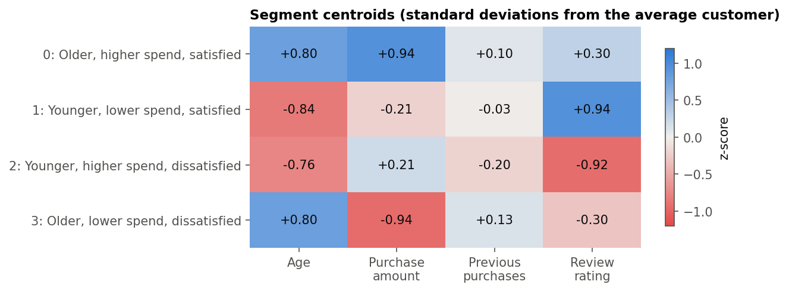
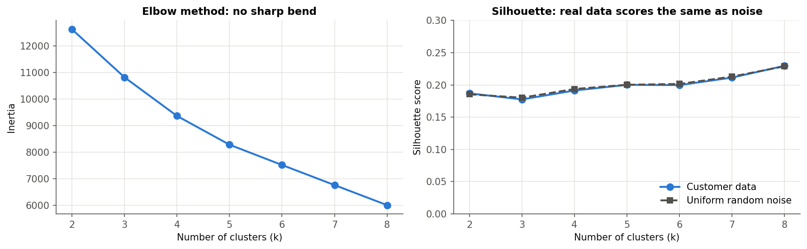
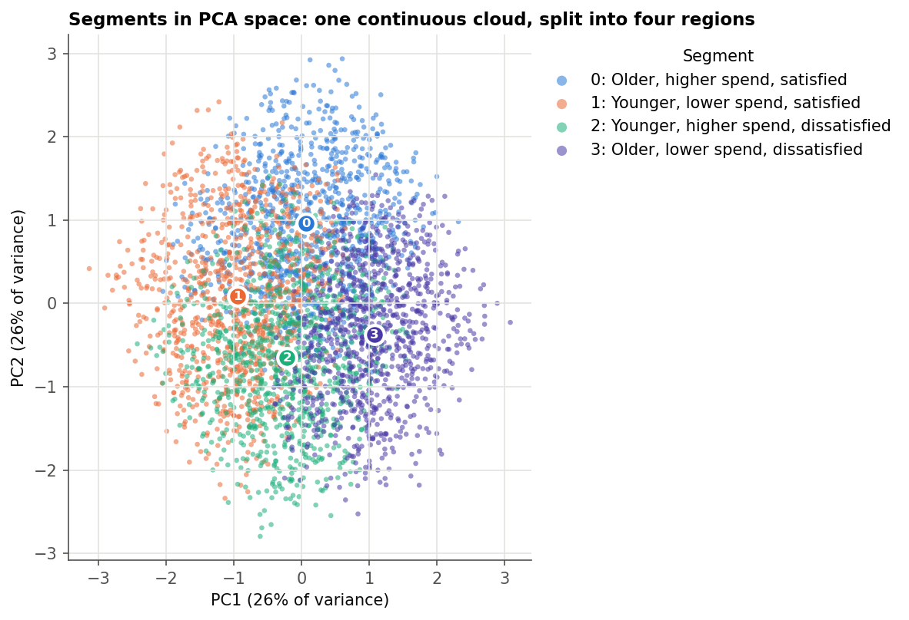

# Customer Segmentation with K-Means

Splitting 3,900 retail customers into segments a marketing team can act on, and then testing
whether those segments are **real structure in the data or just a way of cutting it up**.



## TL;DR

- K-Means (k = 4) on **age, purchase amount, previous purchases and review rating** gives four
  evenly sized segments that are easy to describe, such as *"younger, higher spend, dissatisfied"*.
- A random-noise baseline shows the dataset has **no natural clusters**. The silhouette score
  on the real data matches uniform random data at every *k*, and rerunning with different seeds
  gives different segments (median ARI 0.47).
- **Takeaway:** the segments are still usable as a simple age × spend × satisfaction targeting
  grid, but they are a convenient split of the customers, not customer types found in the
  data. On this dataset, a plain rule-based split would work just as well.

## Dataset

[Customer Shopping Trends](https://www.kaggle.com/datasets/iamsouravbanerjee/customer-shopping-trends-dataset)
(Kaggle, synthetic). It has 3,900 customers and 18 columns covering demographics, purchase
amount, product category, season, review rating, subscription status, discount use and
purchase history. There are no missing values or duplicates. A copy is in
[`data/shopping_trends.csv`](data/shopping_trends.csv).

## Approach

1. **Clean.** Convert column names to snake_case.
2. **Explore.** All four numeric features are close to uniform and nearly uncorrelated.
3. **Pick features.** Use the four numeric features, scaled with `StandardScaler`. I kept purchase
   amount (USD) and previous purchases (a count) as separate features rather than adding them
   together, since the sum would have no clear unit.
4. **Choose *k*.** Use the elbow method, the silhouette score, and a **uniform-noise baseline**
   (the same pipeline run on random data with the same shape).
5. **Profile.** Show the standardized centroids as a heatmap, plot the segments in PCA space,
   and compare segments on variables that were *not* used for clustering (subscription,
   discounts, category).
6. **Validate.** Check stability across 10 random seeds with the Adjusted Rand Index.

## Results

### The segments

| # | Segment | Avg age | Avg purchase | Avg rating | Customers | Suggested action |
|---|---|---|---|---|---|---|
| 0 | Older, higher spend, satisfied | 56 | $82 | 4.0 | 966 | VIP perks, early access, referrals |
| 1 | Younger, lower spend, satisfied | 31 | $55 | 4.4 | 969 | Bundles and cross-sell to grow basket size |
| 2 | Younger, higher spend, dissatisfied | 33 | $65 | 3.1 | 986 | Service recovery: follow up on reviews |
| 3 | Older, lower spend, dissatisfied | 56 | $38 | 3.5 | 979 | Low-cost win-back offers and feedback surveys |

Previous purchases barely differs between segments (every centroid is within ±0.2 SD of the
average), so the split is driven by age, spend and rating.

### Are the segments real?



The elbow curve has no bend, and the silhouette score (around 0.19–0.23) follows the
uniform-noise baseline almost exactly. The PCA projection shows the same thing: one continuous
cloud of customers, divided into regions.



Two more checks agree:
- **Stability:** the median Adjusted Rand Index across random seeds is **0.47**. The data can be
  split in several near-equal ways, and the random start decides which split you get.
- **External validity:** subscription rate, discount use, gender mix and category mix are
  almost identical across segments.

I think this is the most useful finding in the project. K-Means **always** returns *k*
clusters, even when the data has none, so comparing against a noise baseline is a quick way to
catch that before the segments reach a stakeholder.

## Limitations and next steps

- **The data is synthetic.** Its features are independent and uniformly distributed, so no
  clustering method would find natural groups in it. The pipeline is ready to run on real
  transaction data.
- **Categorical features are ignored.** K-Means needs numeric inputs. **K-Prototypes** or Gower
  distance with hierarchical clustering could include category, season and payment method.
- **RFM segmentation.** `frequency_of_purchases` could be turned into purchases per year to build
  Recency-Frequency-Monetary segments, which is the standard approach in retail.

## Run it yourself

```bash
git clone https://github.com/RatanaSovann/customer-segmentation.git
cd customer-segmentation
pip install -r requirements.txt
jupyter notebook customer_segmentation.ipynb
```

## Project structure

```
├── customer_segmentation.ipynb   # full analysis (executed, with outputs)
├── data/shopping_trends.csv      # dataset
├── images/                       # figures used in this README (generated by the notebook)
└── requirements.txt
```

## Tech

Python · pandas · NumPy · scikit-learn (KMeans, PCA, silhouette, ARI) · Matplotlib
